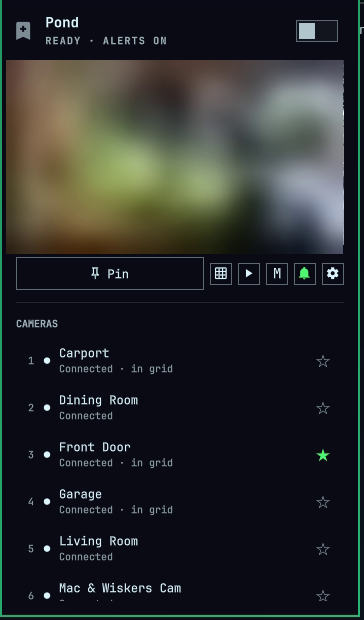
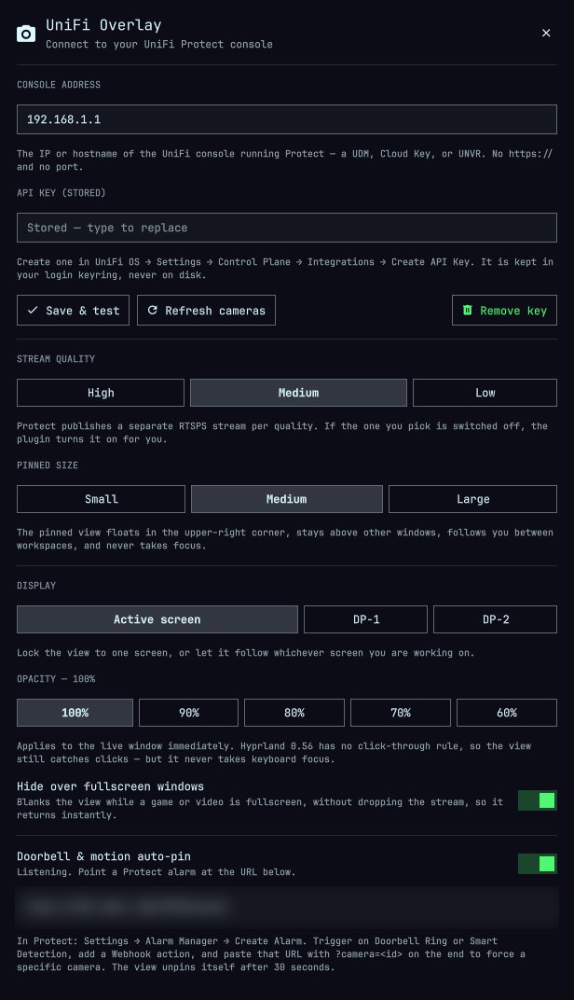

# UniFi Overlay for Omarchy

Pin a live UniFi Protect camera to the upper-right corner of the screen, cycle
cameras from the bar, show four at once, and pop up automatically when the
doorbell rings.

> Not affiliated with or endorsed by Ubiquiti.

<p align="center">
  
  &nbsp;&nbsp;
  
</p>

<p align="center"><sub>Camera feed and webhook address blurred. Everything else is the real UI.</sub></p>

## Install

```bash
omarchy plugin add https://github.com/Fiala06/omarchy-unifi-overlay.git
~/.config/omarchy/plugins/io.github.fiala06.unifi-overlay/setup
omarchy plugin enable io.github.fiala06.unifi-overlay --section right
```

`setup` installs the Hyprland window rules that float, pin and place the camera
window, and wires them into `hyprland.lua`. It has to be a separate step because
Omarchy's plugin installer deliberately never runs plugin code. It backs up
anything it replaces and is safe to re-run.

Then create an API key in UniFi OS (**Settings → Control Plane → Integrations →
Create API Key**) and paste it into the plugin's settings — right-click the bar
icon, then the gear.

The scripting commands keep the short `unifi-overlay` IPC name, so keybinds do
not have to carry the full id.

### Upgrading from 1.x

Versions before 2.0 used the un-namespaced id `unifi-overlay`. Omarchy names the
install directory after the manifest id, so the rename needs one manual move:

```bash
cd ~/.config/omarchy/plugins
mv unifi-overlay io.github.fiala06.unifi-overlay
sed -i 's/"id": "unifi-overlay"/"id": "io.github.fiala06.unifi-overlay"/' \
  ~/.config/omarchy/shell.json
omarchy restart shell
```

Your console address, API key and settings are untouched — they are keyed on the
config file and the keyring, not the plugin id.

### Uninstall

```bash
~/.config/omarchy/plugins/io.github.fiala06.unifi-overlay/teardown   # --purge also drops config + API key
omarchy plugin remove io.github.fiala06.unifi-overlay
```

Run `teardown` *before* removing the plugin, while the bridge is still there to
stop its own daemons. It stops the pinned view and the alert listener (which
otherwise keeps holding its port), removes the window rules, and unwires the
`require` line from `hyprland.lua`, backing it up first. Your console address
and API key are kept unless you pass `--purge`.

## The bar icon

| Gesture | What it does |
|---|---|
| **Left click** | Pin / unpin the live view in the upper-right corner |
| **Right click** | Open the picker — preview, camera list, mode and size |
| **Middle click** | Open the camera in a normal, focusable window |
| **Scroll** | Step through your favourite cameras, re-pinning as you go |
| **Hover** | Name and state; optionally opens the panel (off by default) |

The glyph carries the state: dim when unconfigured or unreachable, normal when
ready, accent-coloured while pinned. A small dot in the corner means the
doorbell listener is armed.

## In the picker

`j`/`k` or `↑`/`↓` move, `enter` selects, and `1`–`9` jump straight to a camera.
`p` pins, `o` opens a window, `z` cycles size, `g` toggles the grid, `f`
favourites the camera under the cursor, `a` toggles alerts, `r` refreshes, `s`
opens settings, `esc` closes.

Favourites are the list the scroll wheel cycles. Mark a few and the wheel
becomes the fastest way to flip between the cameras you actually watch.

## Grid mode

Grid mode shows up to four cameras as one pinned window. In grid mode the
camera list edits grid membership instead of picking a single camera — click
four, then pin.

It runs as a **single** mpv process using `--lavfi-complex`, rather than four
processes or an ffmpeg pipe, which keeps the CPU cost close to one stream's.

## Doorbell and motion auto-pin

Protect's Integration API has no event stream — v1 exposes no `/subscribe`, and
the legacy websocket rejects API keys — so this uses Protect's **Alarm Manager
webhook** instead. That is a deliberate trade: it needs one manual step, but it
means the plugin never has to store your UniFi password.

1. Turn on **Doorbell & motion auto-pin** in settings and copy the URL it shows
   (`http://<this machine>:8723/event?token=…`).
2. In Protect: **Settings → Alarm Manager → Create Alarm**.
3. Trigger on **Doorbell Ring** or a **Smart Detection**, add a **Webhook**
   action, and paste the URL — token and all.
4. Append `&camera=<id>` to force a specific camera; without it the alarm pins
   whichever camera is currently selected. `bin/unifi-protect cameras` lists ids.

The token is minted the first time you enable alerts and is what authorises the
console; treat the URL as a secret. Requests are accepted from this machine, from
an address the console resolves to, or with a valid token — anything else gets a
403, so a stray host on the LAN cannot make camera feeds appear on your desktop.
Alerts cannot be armed at all until a console is configured.

Once enabled, the listener comes back on its own after a reboot or an
`omarchy restart shell`; the shell calls `unifi-protect alerts ensure` on start-up.

The view goes away after `alertSeconds` (30 by default, settable in settings). If
you had already pinned a camera yourself when the alarm fired, that pin is put
back rather than dropped.

## Behaviour of the pinned window

- Floats above everything, follows you between workspaces, never takes keyboard
  focus.
- **Auto-hides over fullscreen windows** so it doesn't sit on top of a game or a
  film. It blanks rather than closing, so it returns instantly instead of
  reconnecting. It checks at pin time as well as on each fullscreen change, and
  a stream that reconnects mid-game stays blanked.
- Opacity is adjustable and applies live, without re-pinning.
- Can be locked to one display or left to follow whichever screen is active.

**It is not click-through.** Hyprland 0.56 has no rule for that (`no_input`,
`noinput` and `nofocus` are not fields it recognises), so the window still
catches clicks that land on it. `no_focus` is as close as the compositor gets:
clicking it never moves your keyboard focus.

## Credentials

The console address is the IP or hostname of the UniFi console running Protect
— a UDM, Cloud Key or UNVR — with no `https://` and no port.

The API key lives in your login keyring via `secret-tool`, never on disk, and is
passed to the bridge on stdin so it never appears in `argv`. The rest of the
config is plain JSON at `~/.config/omarchy/unifi-overlay.json`.

## Streams

Protect publishes a separate RTSPS stream per quality, and each must be switched
on per camera. If the quality you pick is off, the plugin turns it on through
the Integration API rather than making you hunt through the Protect UI.

Playback is `mpv` over RTSPS on port 7441. Note that ffmpeg 9 defaults
`tls_verify` to **true** while UniFi consoles use a self-signed certificate —
raw `ffmpeg` refuses these streams, but mpv's own `--tls-verify` defaults to
`no`, which is why this works. A supervisor restarts mpv with backoff across
camera reboots and network blips.

## Scripting

Everything is on the shell's IPC:

```bash
omarchy-shell unifi-overlay togglePin     # pin / unpin
omarchy-shell unifi-overlay next          # next favourite
omarchy-shell unifi-overlay prev
omarchy-shell unifi-overlay grid          # toggle 4-camera grid
omarchy-shell unifi-overlay cycleSize     # small -> medium -> large
omarchy-shell unifi-overlay view          # full window
omarchy-shell unifi-overlay alerts        # arm / disarm auto-pin
omarchy-shell unifi-overlay camera <id>
omarchy-shell unifi-overlay status        # JSON
```

`~/.config/hypr/bindings.lua` has a commented block with all of these ready to
bind — fill in the key you want and uncomment the line.

You can also drive a pin from your own scripts, since the listener trusts
localhost and needs no token there:

```bash
curl -X POST 'http://127.0.0.1:8723/event?camera=<id>'
```

And the bridge works standalone:

```bash
bin/unifi-protect cameras
bin/unifi-protect favorites add --camera-id <id>
bin/unifi-protect pip start --mode grid --size large
bin/unifi-protect alerts status
bin/unifi-protect alerts ensure   # start only if enabled and not already up
```

## Window placement

Geometry lives in `~/.config/hypr/unifi_overlay.lua`, required from
`hyprland.lua`. `bin/unifi-protect` launches mpv with a per-mode, per-size
app-id (`omarchy-unifi-pip-medium`, `omarchy-unifi-grid-large`, …) so the rules
target it without catching mpv's other windows. Sizes are 16:9 and scale from
monitor height.

Two things there are deliberate and worth not "fixing":

- `move` restates the width expression instead of using `window_w`. The rule is
  evaluated before the window is sized, so `window_w` reads as 0 and the view
  lands mid-screen. `webcam-overlay.lua` in the Omarchy defaults does the same.
- There is no `keep_aspect_ratio`. The presets are already 16:9, and letting
  Hyprland re-fit the window once mpv learns the video size moves it back out of
  the corner *after* the move rule has run — which made placement erratic.

A single-display lock is written to `unifi_overlay_monitor.lua` by the plugin
when you pick a monitor; it is absent until then.

## Requirements

- Omarchy 4 (`schemaVersion: 1` plugin API), Hyprland 0.56+
- A UniFi console running Protect, reachable on the LAN
- `mpv`, `python3`, and `secret-tool` (libsecret) with a running keyring
